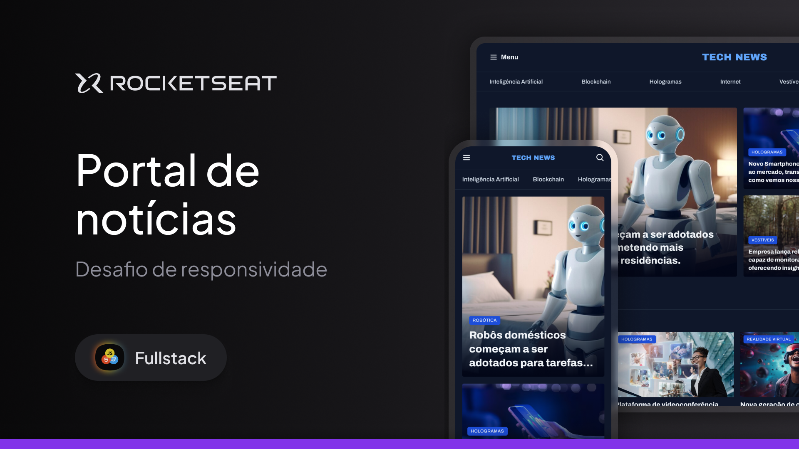

<h1>Portal de Notícias Tech 📰</h1> 

Um portal de notícias moderno com foco em tecnologia, criado durante o curso da Rocketseat. O layout foi disponibilizado no Figma, e posteriormente o projeto foi adaptado para ser totalmente responsivo.
 
 
<h2>Descrição</h2> 

O projeto <strong>Portal de Notícias Tech</strong> simula uma página real de um portal jornalístico sobre tecnologia, com seções como Inteligência Artificial, Realidade Virtual, Hologramas, Internet e muito mais. A estrutura foi construída com HTML semântico, estilização em CSS moderna (utilizando grid layout), e funcionalidades com JavaScript puro — como truncamento de texto baseado no tamanho da tela.
 
O layout é responsivo, oferecendo uma experiência de leitura agradável tanto em dispositivos móveis quanto em desktop.
 
<h2>Tecnologias</h2> 

Este projeto foi desenvolvido com as seguintes tecnologias:
 

 
     

<small>Thank you for reading! ❤️</small>
